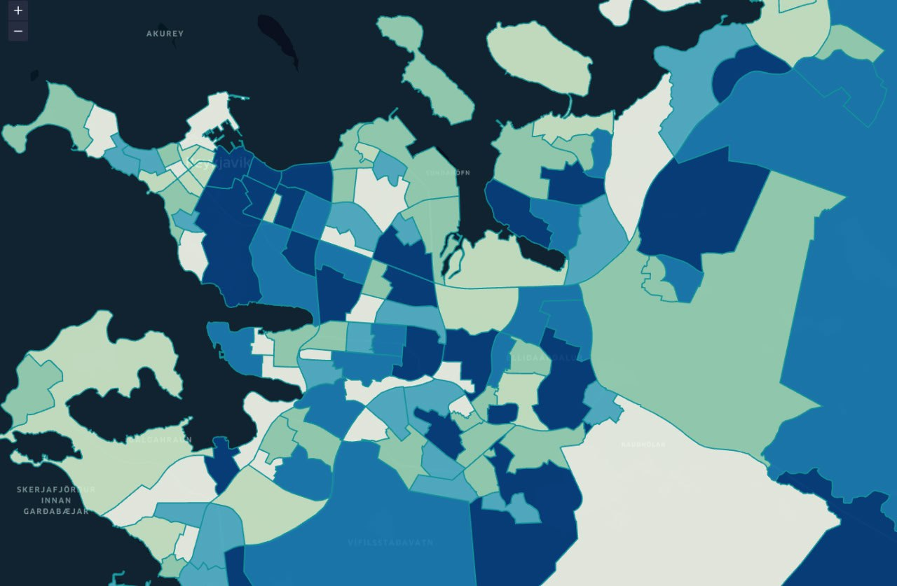
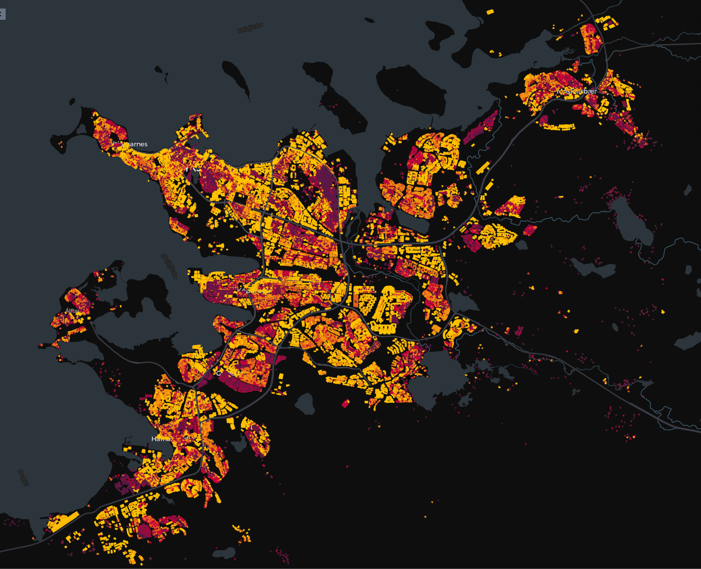
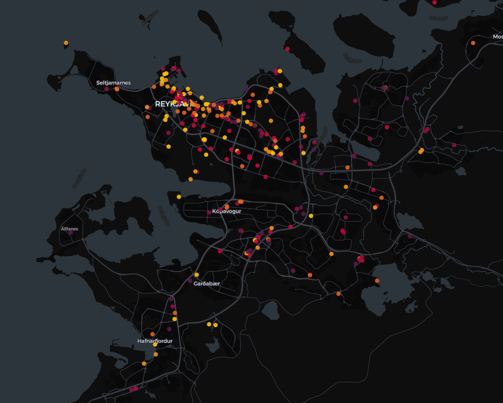
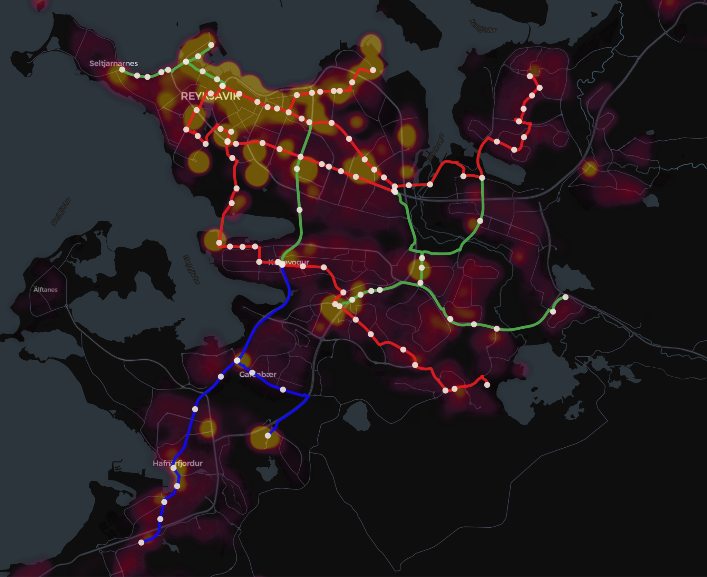
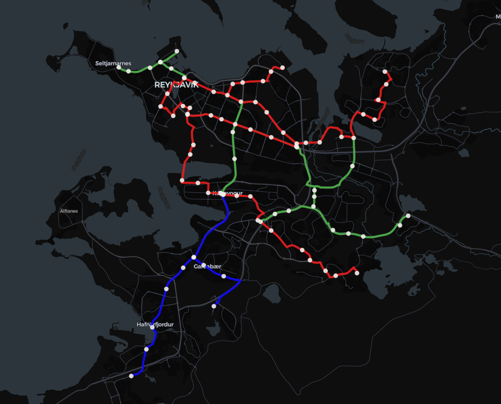

# Icelandic Railroad Company: README


## Project Overview

The **Icelandic Railroad Company** project aims to integrate high-value datasets into the planning and optimization of the proposed Borgarlínan public transport system. Using data-driven methods, we evaluate the feasibility and optimization of train routes based on societal needs, urban accessibility, and economic factors. This project was developed as part of Gagnaþon 2024.

## Authors
- Ivan Tambovtsev
- Anoop Ajaya Kumar Nair
- Ólafur Siemsen Sigurðarson
- V. Tegara

## DEMO

Click the thumbnail below to watch the video:

[](https://youtu.be/IMCta2r0tjs)

## Key Objectives

1. **Railroad Feasibility**: Evaluate the alignment and design of railroad tracks using various datasets.
2. **Urban Integration**: Improve accessibility by integrating residential areas, work areas, and points of interest (POI).
3. **Passenger Flow**: Optimize train schedules and station placements to meet population needs and minimize travel times.
4. **Heatmap Analysis**: Use data-driven heatmaps to visualize the population, income, work distribution, and accessibility scores.

## Features

- **Data-Driven Anal`ysis**: Incorporates geospatial data, population statistics, income distributions, and POIs for route optimization.
- **Transport Scheduling**: Simulates passenger flow and optimizes train schedules.
- **Visualization**: Generates heatmaps and accessibility scores to evaluate railroad routes.
- **High-Value Datasets**:
  - Residential Data (`ibudir.csv`, `ibuafjoldi.csv`)
  - Work Areas (`fjoldi_starfandi.csv`)
  - Income Data (`tekjutiundir.csv`)

## Directory Structure

```plaintext
.
├── code
│   ├── [Data Processing Jupyter Notebooks]
│   ├── railroad.py         # Core functions for railroad processing
│   └── utils.py            # Utility functions for data processing
├── data
│   ├── [Geospatial Data Files]
│   ├── [Population and Economic Datasets]
│   └── [Train Simulation Data]
├── datahon_shared_files    # Shared files for Gagnaþon collaboration
│   ├── [GeoJSON, CSV, and Metadata Files]
│   └── Visualization Scripts (e.g., R and Python)
├── LICENSE
└── README.md
```

## Tech Stack

- **Programming Languages**: Python (Jupyter Notebooks)
- **Visualization**: Foursquare, Matplotlib, NetworkX
- **Geospatial Analysis**: GeoPandas, Shapely
- **Transport Simulation**: NetworkX

## Usage

### 1. Installation

Clone the repository and navigate to the project directory:

```bash
git clone https://github.com/imtambovtcev/icelandic-railroad-company.git
cd icelandic-railroad-company
```

Install the required Python libraries:

```bash
pip install -r requirements.txt
```

### 2. Data Processing

Process the data by following the steps outlined in the numbered Jupyter notebooks located in the `code` directory. The numbers indicate the recommended order of execution:

1. **Junctions and Parking Setup**:
   - `(4_1)junctions.ipynb`: Define and process railroad junctions.
   - `(4_2)parking.ipynb`: Plan and refine parking areas near railroad stations.

2. **Graph Construction**:
   - `(5_0)turns_data_processing.ipynb`: Process data to define railroad turns.
   - `(5_1)turns_to_graph.ipynb`: Convert railroad turns into a graph structure.
   - `(5_2)graph_to_edge_graph.ipynb`: Transform the graph into an edge graph for further processing.

3. **Data Preparation**:
   - `(6_0)data.ipynb`: Prepare the base dataset for analysis and processing.
   - `(6_1)roads_manual_adgustment.ipynb`: Adjust road data manually as required.
   - `(6_2)process_stations.ipynb`: Process and refine station data.
   - `(6_3)basic_routes.ipynb`: Define and process basic routes between stations.

4. **District and Points of Interest Analysis**:
   - `(7_0)district_data.ipynb`: Analyze district-level data for railroad planning.
   - `(7_1)points_of_interest_data.ipynb`: Process data on points of interest near the railroad.
   - `(7_2)building_area.ipynb`: Examine building areas for proximity to planned routes.

5. **Lattice and Useful Connections**:
   - `(7_9)usefull_lattice.ipynb`: Create a useful lattice structure to optimize railroad connections.

6. **Railroad Creation and Adjustment**:
   - `(8_0)apply_data_to_railroad.ipynb`: Apply processed data to create the initial railroad.
   - `(8_1)find_new_stops_for_railroad.ipynb`: Identify additional stops for the railroad.
   - `(8_2)add_new_stops_to_railroad.ipynb`: Add newly identified stops to the railroad structure.
   - `(8_3)creating_routes.ipynb`: Finalize and optimize the routes for the railroad.

7. **Running the Railroad**:
   - `(9_0)run_trains.ipynb`: Simulate and evaluate train operations based on the finalized railroad data.

8. **JSON Conversion**:
   - `(10_0)json_to_trains.ipynb`: Convert railroad data into JSON format for train simulations.


This structure starts at **1** for the user-facing documentation while maintaining the correct usage sequence of the files. Let me know if you need further clarification or refinement!

### 3. Visualization

To visualize the generated GeoJSON data:
1. Use [Foursquare Studio](https://studio.foursquare.com) or another GeoJSON visualization tool.
2. Load the output files produced in the notebooks to create interactive maps and visualizations.

#### Examples
Original population density

Postprocessed population density

Places of interest

Score field and initial stations distribution

Final plan for the year 2030



## License
This project is licensed under the [MIT License](LICENSE).

For further questions or suggestions, please contact the authors.